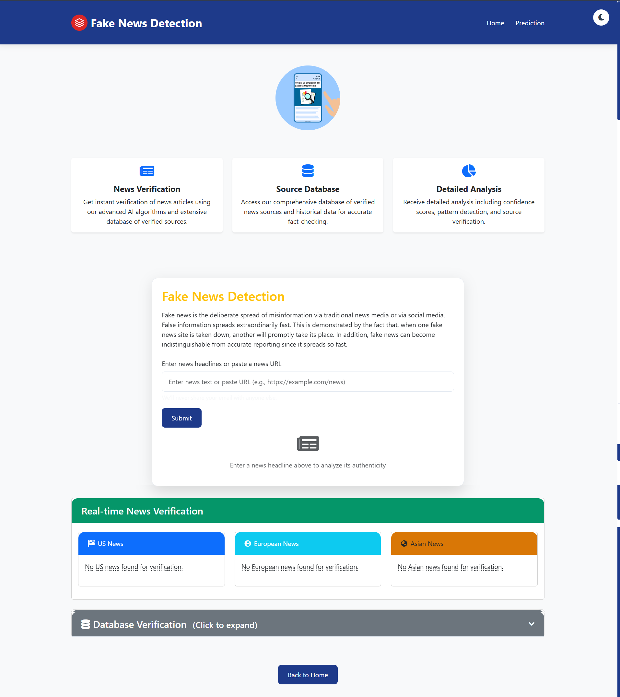
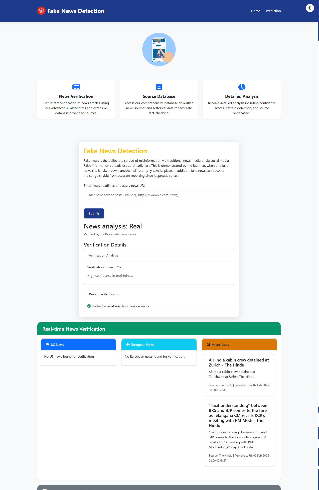

# 🤖 RAG-Powered Fake News Detection System

A sophisticated AI-powered web application that uses **Retrieval-Augmented Generation (RAG)** to detect and analyze fake news in real-time. Built with Flask, machine learning, and advanced NLP techniques.


## 📋 Table of Contents

- [Features](#-features)
- [Screenshots](#-screenshots)
- [Technology Stack](#-technology-stack)
- [Installation](#-installation)
- [Usage](#-usage)
- [API Endpoints](#-api-endpoints)
- [Project Structure](#-project-structure)
- [How It Works](#-how-it-works)
- [Contributing](#-contributing)
- [License](#-license)

## ✨ Features

### 🔍 **Advanced News Analysis**
- **Text-based Analysis**: Analyze news headlines and articles
- **URL-based Analysis**: Extract and analyze news from URLs
- **Real-time Verification**: Cross-reference with live news sources
- **Confidence Scoring**: AI-powered confidence assessment

### 🤖 **RAG-Powered Intelligence**
- **Retrieval-Augmented Generation**: Enhanced analysis using similar articles
- **Vector Search**: FAISS-based similarity search
- **Contextual Analysis**: Understand news context and patterns
- **Source Verification**: Database-backed credibility checking

### 🌐 **Multi-Source Integration**
- **NewsAPI Integration**: Real-time news from multiple regions
- **GNews API**: Additional news source verification
- **Google News RSS**: Comprehensive news coverage
- **Regional Analysis**: US, Europe, and Asian news sources

### 📊 **Comprehensive Reporting**
- **Pattern Detection**: Identify suspicious patterns in news
- **Source Credibility**: Evaluate news source reliability
- **Geographical Fact Checking**: Verify location-based claims
- **Historical Fact Verification**: Cross-reference historical data

### 🎨 **Modern UI/UX**
- **Responsive Design**: Works on all devices
- **Dark/Light Theme**: Toggle between themes
- **Interactive Animations**: Lottie animations for better UX
- **Real-time Updates**: Live news verification display

## 📸 Screenshots

### Home Page

*Welcome page with animated reporter and feature overview*

### Prediction Page

*Analysis interface with real-time verification results*

### Analysis Results

*Detailed analysis with confidence scores and verification details*

## 🛠 Technology Stack

### Backend
- **Python 3.8+**: Core programming language
- **Flask**: Web framework
- **Scikit-learn**: Machine learning algorithms
- **Sentence Transformers**: NLP embeddings
- **FAISS**: Vector similarity search
- **Pandas**: Data manipulation

### AI/ML
- **RAG (Retrieval-Augmented Generation)**: Enhanced analysis
- **Zero-shot Classification**: Fact-checking pipeline
- **TextBlob**: Sentiment analysis
- **Transformers**: Advanced NLP models

### Frontend
- **Bootstrap 5**: Responsive UI framework
- **Font Awesome**: Icons
- **Lottie**: Animated graphics
- **JavaScript**: Interactive features

### APIs & Services
- **NewsAPI**: Real-time news data
- **GNews API**: Additional news sources
- **Google News RSS**: RSS feed integration

## 🚀 Installation

### Prerequisites
- Python 3.8 or higher
- pip (Python package installer)
- Git

### Step 1: Clone the Repository
```bash
git clone https://github.com/yourusername/rag-fake-news-detector.git
cd rag-fake-news-detector
```

### Step 2: Create Virtual Environment
```bash
python -m venv venv
source venv/bin/activate  # On Windows: venv\Scripts\activate
```

### Step 3: Install Dependencies
```bash
pip install -r requirements.txt
```

### Step 4: Set Up Environment Variables
Create a `.env` file in the root directory:
```env
NEWSAPI_KEY=your_newsapi_key_here
GNEWS_API_KEY=your_gnews_api_key_here
```

### Step 5: Initialize the System
```bash
python app.py
```

The application will automatically:
- Load the pre-trained model
- Create FAISS index for similarity search
- Start the Flask development server

### Step 6: Access the Application
Open your browser and navigate to:
```
http://localhost:5000
```

## 📖 Usage

### 1. **Text-based Analysis**
1. Navigate to the Prediction page
2. Enter a news headline or article text
3. Click "Submit"
4. View detailed analysis results

### 2. **URL-based Analysis**
1. Paste a news URL in the input field
2. Click "Submit"
3. System will extract and analyze the content
4. Get comprehensive verification results

### 3. **Understanding Results**
- **Confidence Score**: AI's confidence in the analysis
- **Verification Details**: Pattern analysis and source credibility
- **Similar Articles**: RAG-powered similar news articles
- **Real-time News**: Live news from multiple regions

## 🔌 API Endpoints

### GET `/`
- **Description**: Home page
- **Response**: HTML page with application overview

### GET `/prediction`
- **Description**: Prediction page (empty form)
- **Response**: HTML page with analysis form

### POST `/prediction`
- **Description**: Analyze news content
- **Parameters**: 
  - `news` (string): News text or URL
- **Response**: HTML page with analysis results

## 📁 Project Structure

```
rag-fake-news-detector/
├── app.py                 # Main Flask application
├── rag_engine.py          # RAG engine implementation
├── requirements.txt       # Python dependencies
├── Procfile              # Heroku deployment config
├── README.md             # Project documentation
├── .gitignore            # Git ignore rules
├── .env                  # Environment variables (create this)
├── templates/            # HTML templates
│   ├── index.html        # Home page
│   └── prediction.html   # Prediction page
├── static/               # Static assets
│   ├── style.css         # Custom CSS
│   ├── animation1.json   # Lottie animation
│   ├── animation2.json   # Lottie animation
│   └── image.svg         # SVG assets
├── screenshots/          # Application screenshots
│   ├── home-page.png
│   ├── prediction-page.png
│   └── analysis-results.png
├── data/                 # Data files (not in repo)
│   ├── news.csv          # News dataset
│   ├── news_index.faiss  # FAISS index
│   ├── vectorizer.pkl    # Vectorizer model
│   └── finalized_model.pkl # ML model
└── venv/                 # Virtual environment
```

## 🔬 How It Works

### 1. **RAG Engine Architecture**
```
Input → Preprocessing → Vector Embedding → FAISS Search → Similar Articles → Analysis
```

### 2. **Analysis Pipeline**
1. **Input Processing**: Clean and preprocess news text/URL
2. **Vector Embedding**: Convert text to numerical vectors
3. **Similarity Search**: Find similar articles using FAISS
4. **Pattern Analysis**: Detect suspicious patterns
5. **Source Verification**: Check source credibility
6. **Real-time Cross-reference**: Verify with live news sources
7. **Confidence Scoring**: Generate confidence assessment

### 3. **Key Components**

#### RAG Engine (`rag_engine.py`)
- **Sentence Transformers**: Text embedding generation
- **FAISS Index**: High-performance similarity search
- **Multi-source Integration**: NewsAPI, GNews, Google News RSS
- **Pattern Detection**: Identify fake news patterns
- **Fact Checking**: Zero-shot classification for verification

#### Web Application (`app.py`)
- **Flask Framework**: Web server and routing
- **URL Validation**: Input sanitization and validation
- **Template Rendering**: Dynamic HTML generation
- **Error Handling**: Robust error management

## 🤝 Contributing

We welcome contributions! Please follow these steps:

1. **Fork the repository**
2. **Create a feature branch**: `git checkout -b feature/amazing-feature`
3. **Commit your changes**: `git commit -m 'Add amazing feature'`
4. **Push to the branch**: `git push origin feature/amazing-feature`
5. **Open a Pull Request**

### Development Setup
```bash
# Install development dependencies
pip install -r requirements.txt

# Run tests (if available)
python -m pytest

# Start development server
python app.py
```

## 📝 License

This project is licensed under the MIT License - see the [LICENSE](LICENSE) file for details.

## 🙏 Acknowledgments

- **NewsAPI**: For providing real-time news data
- **GNews**: For additional news source integration
- **Sentence Transformers**: For advanced NLP capabilities
- **FAISS**: For efficient similarity search
- **Bootstrap**: For responsive UI components

## 📞 Support

If you have any questions or need support:

- **Issues**: [GitHub Issues](https://github.com/yourusername/rag-fake-news-detector/issues)
- **Email**: your-email@example.com
- **Documentation**: [Wiki](https://github.com/yourusername/rag-fake-news-detector/wiki)

---

<div align="center">
  <p>Made with ❤️ by [Your Name]</p>
  <p>⭐ Star this repository if you found it helpful!</p>
</div> 